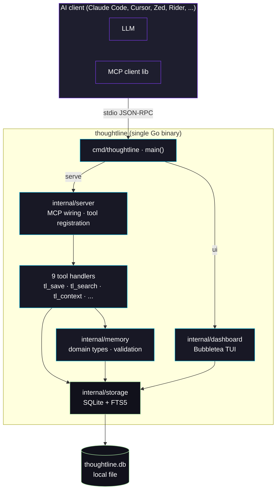
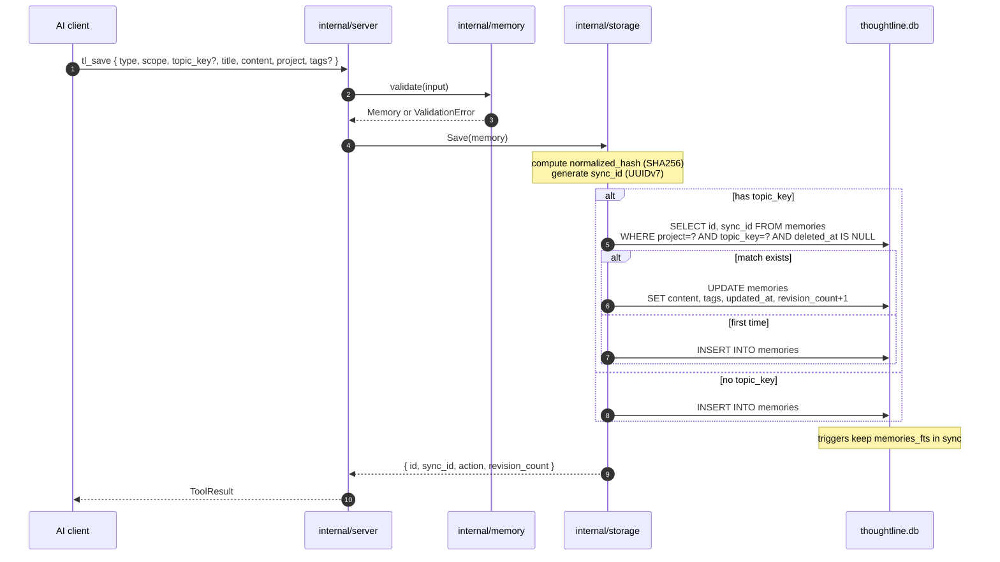
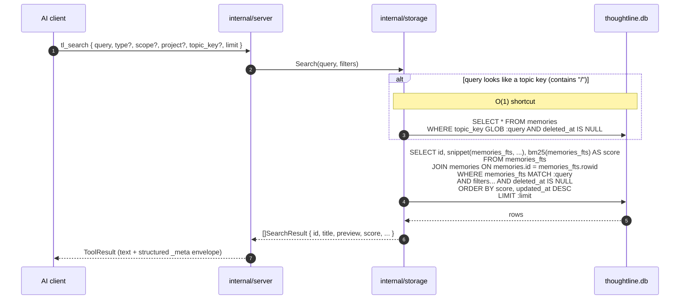

# Architecture

How Thoughtline is put together. This is the holistic tour. For individual decisions, see [`decisions/`](decisions/) (ADRs). For install steps, [INSTALLATION.md](INSTALLATION.md). For positioning, [COMPARISON.md](COMPARISON.md).

> **Status: M5.** Nine MCP tools, single-developer scope, no cloud, no HTTP API. The schema is forward-compatible with embeddings (M6, deferred) — see [ADR 0002](decisions/0002-search-strategy-fts5-first.md).

---

## Goals and constraints

1. **Local-first.** Single binary, single SQLite file. No server process, no cloud, no telemetry.
2. **Single-user.** Each developer runs their own instance against their own database.
3. **MCP-native.** The primary public interface is the Model Context Protocol over stdio. The TUI is a secondary read-mostly surface against the same database.
4. **No CGO.** Cross-compilation must remain a single `go build`. We use [`modernc.org/sqlite`](https://pkg.go.dev/modernc.org/sqlite) (pure Go).
5. **Architecture-compatible with [Engram](https://github.com/Gentleman-Programming/engram).** Same MCP shape, similar storage layout, so improvements can flow in either direction. Differences are deliberate and documented in ADRs and [COMPARISON.md](COMPARISON.md).

---

## High-level diagram



Same binary, two surfaces:

- **`thoughtline serve`** — MCP stdio server. Spawned by an MCP client. Reads JSON-RPC over stdin, writes responses to stdout, logs to stderr.
- **`thoughtline ui`** — Bubbletea TUI. Opens the same SQLite file, read-mostly. Browse / search / inspect from a terminal without touching the AI.

Both share `internal/storage`. What the AI saves is what the dashboard sees, immediately.

---

## The single binary

`cmd/thoughtline/main.go` dispatches:

| Subcommand | Purpose |
|---|---|
| `thoughtline` (no args) / `serve` | MCP stdio server. Default; what AI clients spawn. |
| `thoughtline ui` / `dashboard` | Bubbletea TUI. Flags: `--theme {brand,zbrush,mono}`, `--no-splash`, `--no-update-check`, `--splash-ms N`. |
| `thoughtline protocol` | Emit active-protocol markdown to stdout. Used by the Claude Code plugin's `SessionStart` / post-compaction hooks. Flags: `--event {session-start,post-compaction}`, `--project NAME`, `-o FILE`. |
| `thoughtline version` / `-v` / `--version` | Print version. |
| `thoughtline help` / `-h` / `--help` | Print usage. |

Sister binary at `cmd/migrate/cmd/main.go` — a one-shot **Engram → Thoughtline** data migrator. Reads an Engram SQLite database and writes through Thoughtline's storage layer, so FTS5 indexing, hash normalization, and validation all run as side effects. Not part of the runtime path.

---

## Code map

```
cmd/
├── thoughtline/main.go      # Entry point + subcommand dispatch + protocol.go
└── migrate/                 # One-shot Engram → Thoughtline migrator

internal/
├── memory/                  # Domain types (Memory, Type, Scope) + validation
├── storage/                 # SQLite + FTS5; the only place that touches the DB
├── server/                  # MCP tool registration + handlers (one file per tool)
└── dashboard/               # Bubbletea TUI: model, view, update, themes, splash, cube

docs/
├── decisions/               # ADRs
├── design/                  # Taxonomy, memory domain
├── integrations/            # Per-editor setup (cursor, zed, rider-unity)
└── media/                   # Screenshots, GIFs, banner art

plugin/claude-code/          # Claude Code plugin (commands, agents, skills, hooks)
scripts/                     # Install scripts, vhs demo tape
```

Each `internal/` package has one job and a minimal public API:

### `internal/memory`

Pure domain types. Knows nothing about SQL or MCP. Includes the gamedev taxonomy — `scene-pattern`, `asset-reference`, `perf-gotcha`, `pipeline-step`, `script-pattern`, `game-design-decision` — plus the general types we kept from Engram's vocabulary (`bugfix`, `decision`, `architecture`, `pattern`, `convention`, `preference`). Validation rules live in `validate.go`. Full catalogue in [design/memory-domain.md](design/memory-domain.md) and [design/tag-conventions.md](design/tag-conventions.md).

### `internal/storage`

The only place that talks to SQLite. Built on [`modernc.org/sqlite`](https://pkg.go.dev/modernc.org/sqlite) (pure Go, no CGO). Owns:

- Schema migration (forward-only, versioned).
- CRUD (`Save`, `GetByID`, `GetBySyncID`, `UpdateByID`, `SoftDelete`).
- Search (`Search` — FTS5 + BM25, with the topic-key shortcut).
- Recent activity (`Recent` — for `tl_context`).
- Session lifecycle (M4: `OpenSession`, `CloseSession`, `Sessions`).
- Stats (`Stats` — counts and aggregates for `tl_stats` and the dashboard's Overview tab).

### `internal/server`

The MCP adapter. Built on [`github.com/mark3labs/mcp-go`](https://github.com/mark3labs/mcp-go) — same library Engram uses, picked deliberately for compatibility. Registers each `tl_*` tool with its JSON Schema and prose description, dispatches calls, formats responses. **No SQL in handlers, no MCP types in storage.**

One file per tool keeps handlers reviewable in isolation: `tl_save.go`, `tl_search.go`, `tl_get_observation.go`, `tl_context.go`, `tl_update.go`, `tl_delete.go`, `tl_session_start.go`, `tl_session_summary.go`, `tl_stats.go`.

### `internal/dashboard`

Bubbletea TUI. Standard model/update/view split (`model.go`, `update.go`, `view.go`), plus `themes.go` (palettes), `cube.go` (animated header), `splash.go` (intro), `updatecheck.go` (async GitHub release lookup), `commands.go` (TUI-side storage commands), `items.go` (list rendering), `roadmap.go` (loaded from `roadmap.yaml`), `styles.go` (lipgloss styles).

---

## The MCP surface (9 tools)

All registered in `internal/server/server.go`. The text in each `register*` function is the description **the model reads** when deciding whether to call. Treat it as production prose.

| Tool | What it does |
|---|---|
| `tl_save` | Persist a memory. Proactive — the agent calls this after decisions, gotchas, fixes, conventions. Supports `topic_key` upsert. |
| `tl_search` | FTS5 BM25 over title+content with optional filters (`type`, `scope`, `project`, `topic_key` GLOB). Topic keys with `/` shortcut to O(1) GLOB lookup. Returns 300-char previews. |
| `tl_get_observation` | Fetch a single memory by id with full content + metadata. Use after `tl_search` when the snippet is truncated. |
| `tl_context` | Most-recently-updated memories for the active project. Use at session start or post-compaction. |
| `tl_update` | Patch a live memory: `title`, `content`, `tags` are mutable; `type`, `topic_key`, `project`, `scope` are not (delete + save to "move"). |
| `tl_delete` | Soft-delete by id. Frees `topic_key` for a fresh `tl_save`. |
| `tl_session_start` | Open a session, return UUIDv7. Subsequent `tl_save` calls can pass `session_id` to attach. |
| `tl_session_summary` | Close a session with a final digest. Mandatory before signing off. One-shot — sessions can only close once. |
| `tl_stats` | Database snapshot: counts by type / project / scope, session counts, recent activity. Default scope is the active project; pass `project='*'` for everything. |

---

## Data flow: `tl_save`



---

## Data flow: `tl_search`



Previews are capped (~300 chars) for token economy. The follow-up tool `tl_get_observation` returns untruncated content for a specific id.

---

## Storage schema

The authoritative DDL lives in `internal/storage/schema.go`. Two real tables, one FTS5 virtual table, one bookkeeping table.

### `memories` — the canonical row

```sql
CREATE TABLE memories (
    id              INTEGER PRIMARY KEY AUTOINCREMENT,
    sync_id         TEXT    NOT NULL UNIQUE,        -- UUIDv7, stable across upserts
    project         TEXT    NOT NULL,
    scope           TEXT    NOT NULL CHECK (scope IN ('project','personal')),
    type            TEXT    NOT NULL,               -- gamedev taxonomy + general types
    topic_key       TEXT,                            -- nullable; upsert key
    title           TEXT    NOT NULL,
    content         TEXT    NOT NULL,
    tags            TEXT,                            -- JSON array, nullable
    normalized_hash TEXT    NOT NULL,                -- SHA256 for conflict detection
    revision_count  INTEGER NOT NULL DEFAULT 0,
    created_at      INTEGER NOT NULL,                -- unix epoch ms
    updated_at      INTEGER NOT NULL,
    deleted_at      INTEGER,                         -- soft-delete marker (NULL = live)
    session_id      TEXT,                            -- M4: optional FK to sessions.id

    -- M6 reserved (never written by v1):
    embedding             BLOB,
    embedding_model       TEXT,
    embedding_created_at  INTEGER
);

-- Upsert enforcement: one live memory per (project, topic_key)
CREATE UNIQUE INDEX idx_memories_topic
    ON memories(project, topic_key)
    WHERE topic_key IS NOT NULL AND deleted_at IS NULL;

-- Recency: tl_context's hot path
CREATE INDEX idx_memories_recent
    ON memories(project, updated_at DESC)
    WHERE deleted_at IS NULL;
```

### `memories_fts` — the FTS5 virtual table

```sql
CREATE VIRTUAL TABLE memories_fts USING fts5(
    title,
    content,
    content       = memories,           -- contentless: rows live in `memories`
    content_rowid = id,
    tokenize      = 'unicode61 remove_diacritics 2'
);
```

Three triggers (insert / update / delete) keep `memories_fts` in lockstep. The FTS5 index is **derived** state — if it ever drifts you can drop and rebuild from `memories` without losing data.

### `sessions` — added in v2 (M4)

```sql
CREATE TABLE sessions (
    id           TEXT    PRIMARY KEY,            -- UUIDv7
    project      TEXT    NOT NULL,
    agent_label  TEXT    NOT NULL DEFAULT '',    -- 'claude-code', 'cursor', ...
    started_at   INTEGER NOT NULL,
    ended_at     INTEGER,                         -- NULL while open
    summary      TEXT    NOT NULL DEFAULT ''
);

CREATE INDEX idx_sessions_recent
    ON sessions(project, started_at DESC);
```

`memories.session_id` is an optional foreign key — `tl_save` can attach a memory to the session opened by `tl_session_start`. `tl_session_summary` closes the session by setting `ended_at` and storing the digest.

### `schema_version` — migration tracking

```sql
CREATE TABLE schema_version (
    version    INTEGER PRIMARY KEY,
    applied_at INTEGER NOT NULL
);
```

| Version | Added |
|---|---|
| 1 | `memories` + `memories_fts` + triggers |
| 2 | `sessions` table + `memories.session_id` column |

Migrations are forward-only, additive when possible, and ADR-gated when not.

### Soft delete, not hard

`tl_delete` flips `deleted_at` instead of removing the row. Two reasons:

1. The `(project, topic_key)` unique index excludes `deleted_at IS NOT NULL`, so a soft-deleted memory frees its `topic_key` for a fresh `tl_save`. Topic-keyed memories can effectively be "rotated" without losing audit history.
2. Recovery and forensics. If the agent saves something it shouldn't, you can grep history without dredging the WAL.

### Topic-key upsert

When `tl_save` is called with a `topic_key` and a matching live row exists for the same `(project, topic_key)`, the call **upserts**: same `sync_id`, `revision_count++`, `updated_at` refreshed. This is how a memory like `architecture/auth-model` evolves across months of saves without spawning duplicates.

---

## The TUI

`thoughtline ui` opens the same SQLite file and renders six tabs.

| # | Tab | What it shows |
|---|---|---|
| 1 | Overview | Live stats, recent memories, open sessions, the animated header cube |
| 2 | Browse | Paginated list of all memories for the active project |
| 3 | Search | Live FTS5 search input + result list |
| 4 | Sessions | Active and closed sessions with their summaries |
| 5 | Tags | Tag cloud, filter by tag |
| 6 | Help | Keybinding reference |

**Themes** (cycle with `t`):

- `brand` — default, violet + cyan adaptive palette.
- `zbrush` — warm amber, dark-only. The visual differentiator from generic dev tooling. Tuned for long art-pipeline sessions.
- `mono` — grayscale, useful for screenshots and 1-bit terminals.

**Other keybindings**: `1`-`6` jump to tab, `Tab` / `Shift+Tab` cycle, `/` enters search input (in Search tab), `r` refreshes the active tab, `?` toggles Help, `u` opens the latest-release URL when a new version is available, `q` / `Esc` / `Ctrl+C` quits.

**Update check** — on startup the dashboard hits `https://api.github.com/repos/AgusLoza2021/Thoughtline/releases/latest` async. Non-blocking. Shows a status-bar pill if a newer tag is published. Opt-out with `--no-update-check`.

**Lazy tab loading** — `ensureTabLoaded()` defers the database query for a tab until the user first navigates there.

---

## Configuration

Three env vars, all optional. See [INSTALLATION.md § Configuration](INSTALLATION.md#configuration) for the full table.

- `THOUGHTLINE_DB` — full path to the SQLite file. Wins over everything.
- `THOUGHTLINE_HOME` — directory for the SQLite file (DB is `<HOME>/thoughtline.db`).
- `THOUGHTLINE_PROJECT` — default project identifier when an MCP call omits `project`. Falls back to the basename of the working directory at startup.

Default storage location resolves to the platform user-data dir (per [ADR 0003](decisions/0003-state-dir-not-cache-dir.md)):

| Platform | Default path |
|---|---|
| Windows | `%LOCALAPPDATA%\thoughtline\thoughtline.db` |
| macOS | `~/Library/Application Support/thoughtline/thoughtline.db` |
| Linux | `${XDG_DATA_HOME:-~/.local/share}/thoughtline/thoughtline.db` |

On first launch after upgrading from a pre-ADR-0003 build, the binary auto-migrates the database from the legacy cache-dir location (`os.UserCacheDir()/thoughtline/`) to the new data-dir path. Migration is conservative: only when the source exists and the destination doesn't, and only when neither `THOUGHTLINE_HOME` nor `THOUGHTLINE_DB` is set. It logs a single line to stderr when it runs.

---

## What's deferred

| Feature | Status | Notes |
|---|---|---|
| Semantic embeddings + vector search | M6, deferred | Schema reserved (`embedding`, `embedding_model`, `embedding_created_at`). [ADR 0002](decisions/0002-search-strategy-fts5-first.md) explains why FTS5-first. Adding M6 logic later is a non-breaking change. |
| HTTP API | Not planned for v1 | MCP-over-stdio is the only network surface today. Engram has both; we don't need it yet. |
| Cloud / cross-machine replication | Not planned | Local-first by design. Manual git sync of the DB file works for solo devs. |
| Multi-writer concurrency | Out of scope | One process writes; SQLite handles concurrent reads. Don't run two `serve` instances against the same file. |
| Conflict surfacing / semantic LLM judging | Engram has it; we don't | If we add it, it's after M6. |
| Plugins / scripting | Not planned | Adds surface area without proven demand. Revisit if asked. |

See [docs/PROGRESS.md](PROGRESS.md) for the full milestone tracker.

---

## Design principles

- **One way to do each thing.** Two competing search strategies, two storage backends, two memory shapes — that is how products die. Pick one, commit.
- **The schema is a contract.** Migrations are forward-only, additive when possible, ADR-gated when not.
- **Every load-bearing decision has an ADR.** If a future contributor asks "why this and not that?", the ADR is the answer.
- **Honest tradeoffs, written down.** Including this one: Thoughtline is a smaller, opinionated cousin of Engram, not a successor.
- **No SQL in handlers, no MCP types in storage.** The package boundary is enforced by what each one imports.

---

## ADRs

The "why" lives in [docs/decisions/](decisions/). Currently:

- [ADR 0001 — Architecture baseline: copy Engram's pattern set, customize taxonomy](decisions/0001-architecture-baseline.md)
- [ADR 0002 — Search strategy: FTS5 + BM25 in v1, embeddings deferred](decisions/0002-search-strategy-fts5-first.md)

If you propose a meaningful architectural change, add an ADR before the code change — that's the bar.

---

## What to read next

- [INSTALLATION.md](INSTALLATION.md) — install + configure + verify
- [COMPARISON.md](COMPARISON.md) — Thoughtline vs Engram vs claude-mem
- [docs/design/tag-conventions.md](design/tag-conventions.md) — the gamedev taxonomy this whole thing is built around
- [docs/design/memory-domain.md](design/memory-domain.md) — full type catalogue and field rules
- [docs/integrations/](integrations/) — per-editor setup
- [plugin/claude-code/README.md](../plugin/claude-code/README.md) — Claude Code plugin reference
- [docs/PROGRESS.md](PROGRESS.md) — milestone tracker
