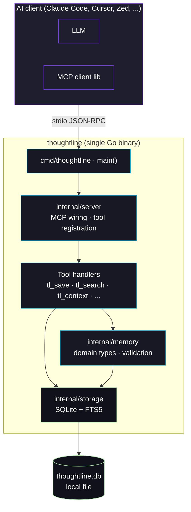
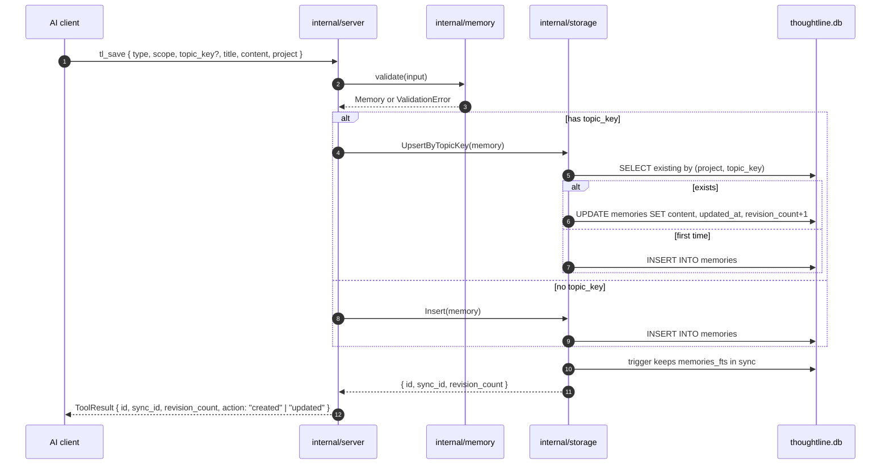
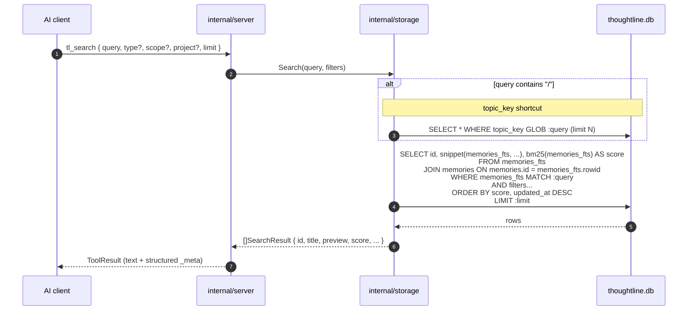

# Architecture

This document describes how Thoughtline is organized and how data flows through it. It is intentionally short; load-bearing decisions live in [`decisions/`](decisions/) as ADRs.

## Goals and constraints

1. **Local-first.** Single binary, single SQLite file. No server process, no cloud, no telemetry by default.
2. **Single-user.** Each developer runs their own instance against their own database.
3. **MCP-native.** The only public interface is the Model Context Protocol over stdio. Everything else is internal.
4. **No CGO.** Cross-compilation must remain a single `go build`.
5. **Architecture-compatible with [Engram](https://github.com/Gentleman-Programming/engram).** Same MCP shape, similar storage layout, so improvements can flow in either direction. Differences are deliberate and documented in ADRs.

## High-level diagram



## Component breakdown

### `cmd/thoughtline`

The binary entry point. Parses flags / env, configures logging, opens the SQLite database, builds the MCP server, blocks until the client disconnects or a signal arrives. **No business logic lives here** — only wiring.

### `internal/server`

The MCP adapter layer. Built on [`github.com/mark3labs/mcp-go`](https://github.com/mark3labs/mcp-go) — the same library Engram uses, picked deliberately for compatibility. This package:

- registers each `tl_*` tool with its JSON Schema and human description;
- dispatches incoming tool calls to handler functions;
- formats responses (text + structured `_meta` envelope) the way mcp-go expects;
- writes structured logs to stderr (stdio is reserved for protocol traffic).

Tool handlers themselves are thin: validate input → call a domain or storage function → format output. **No SQL in handlers, no MCP types in storage** — that separation is enforced by package layout.

### `internal/memory`

Pure domain types: `Memory`, `Type`, `Scope`, `TopicKey`, plus their validation rules. No I/O. This is what handlers and storage agree on. The full type catalogue is documented in [`design/memory-domain.md`](design/memory-domain.md).

### `internal/storage`

The SQLite layer. Responsibilities:

- migrations on startup (versioned, forward-only);
- CRUD for memories (`Insert`, `UpsertByTopicKey`, `GetByID`, `GetBySyncID`, `Update`, `SoftDelete`);
- search (`Search` — FTS5 + BM25, with the topic-key shortcut);
- recent activity (`Recent` — for `tl_context`);
- session helpers (M4).

We use `modernc.org/sqlite` (a pure-Go SQLite driver). FTS5 is enabled at the connection level. No other database is supported — and we do not intend to add one. The whole point of the local-first design is that "your memory" is a file you can copy, back up, and grep.

## Data flow: `tl_save`



## Data flow: `tl_search`



Full preview length is capped (~300 chars) for token economy. The companion tool `tl_get_observation` returns the untruncated content for a specific id.

## Storage schema (sketch)

The authoritative DDL is in `internal/storage/schema.go` once M1 lands. The shape we are committing to:

```sql
CREATE TABLE IF NOT EXISTS memories (
    id              INTEGER PRIMARY KEY AUTOINCREMENT,
    sync_id         TEXT    NOT NULL UNIQUE,
    project         TEXT    NOT NULL,
    scope           TEXT    NOT NULL CHECK (scope IN ('project','personal')),
    type            TEXT    NOT NULL,
    topic_key       TEXT,
    title           TEXT    NOT NULL,
    content         TEXT    NOT NULL,
    normalized_hash TEXT    NOT NULL,
    revision_count  INTEGER NOT NULL DEFAULT 0,
    created_at      INTEGER NOT NULL,    -- unix epoch ms
    updated_at      INTEGER NOT NULL,
    deleted_at      INTEGER,             -- soft delete

    -- M5 reserved (embeddings layer; never written by v1):
    embedding             BLOB,
    embedding_model       TEXT,
    embedding_created_at  INTEGER
);

CREATE UNIQUE INDEX IF NOT EXISTS idx_memories_topic
    ON memories(project, topic_key)
    WHERE topic_key IS NOT NULL AND deleted_at IS NULL;

CREATE INDEX IF NOT EXISTS idx_memories_recent
    ON memories(project, updated_at DESC)
    WHERE deleted_at IS NULL;

CREATE VIRTUAL TABLE IF NOT EXISTS memories_fts USING fts5(
    title,
    content,
    content       = memories,
    content_rowid = id,
    tokenize      = 'unicode61 remove_diacritics 2'
);

-- Triggers keep memories_fts in lockstep:
--   AFTER INSERT  ON memories  → INSERT INTO memories_fts(rowid, title, content) VALUES (new.id, new.title, new.content);
--   AFTER DELETE  ON memories  → INSERT INTO memories_fts(memories_fts, rowid, title, content) VALUES ('delete', old.id, old.title, old.content);
--   AFTER UPDATE  ON memories  → delete-then-insert pattern
```

The reserved `embedding*` columns are the explicit hook for M5 — see [ADR 0002](decisions/0002-search-strategy-fts5-first.md). They are nullable, never written by the v1 codepath, and adding the M5 logic later is a non-breaking change.

## What we deliberately do not do

| Anti-feature                                    | Why we skip it                                                       |
| ----------------------------------------------- | -------------------------------------------------------------------- |
| Cloud sync, multi-user storage                  | Out of scope for v1. Use Engram if you need it.                       |
| TUI / web UI                                    | Thoughtline is consumed by AI clients, not humans, in normal use.     |
| Plugins or scripting                            | Adds surface area without proven demand. Revisit if asked.            |
| Embeddings in v1                                | See [ADR 0002](decisions/0002-search-strategy-fts5-first.md).         |
| Postgres / MySQL / "pluggable backends"         | Local-first is a feature, not a limitation. One database, one truth.  |

## Design principles

- **One way to do each thing.** Two competing search strategies, two storage backends, two memory shapes — that is how products die. Pick one, commit.
- **The schema is a contract.** Migrations are forward-only, additive when possible, and ADR-gated when not.
- **Every load-bearing decision has an ADR.** If a future contributor asks "why this and not that?", the ADR is the answer.
- **Honest tradeoffs, written down.** Including this one: Thoughtline is a smaller, opinionated cousin of Engram, not a successor.
