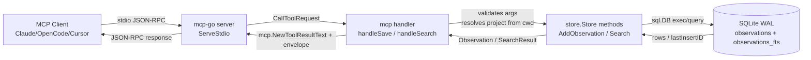

# Engram Anatomy — Architectural Reconnaissance

> First-pass map of the Engram codebase, written for someone who has never opened it. Every claim cites a `file:line` from the local clone at `C:\Users\Agustin Lozano\Desktop\_engram-research\engram`. References are relative to that root.

Engram is a Go-based persistent-memory MCP server. It exposes long-lived memory (decisions, bug fixes, conventions, session summaries) over both an HTTP REST API and an MCP stdio server, backed by an embedded SQLite database with FTS5 full-text search.

## 1. Top-level layout

| Entry | What's in here |
|---|---|
| `cmd/` | Single binary entry point. Subfolder `cmd/engram/` is the `main` package; subcommands (`serve`, `mcp`, `tui`, `search`, `save`, `cloud`, etc.) all live there. |
| `internal/` | All real logic. Organized by concern: `store`, `mcp`, `server`, `project`, `setup`, `sync`, `cloud`, `obsidian`, `tui`, `version`. |
| `plugin/` | OpenCode plugin glue (TypeScript). Out of scope for Thoughtline. |
| `skills/` | Markdown skill files distributed with the binary (memory protocol prompts). |
| `tools/` | Dev/release scripts. Out of scope. |
| `assets/` | Static assets (icons, screenshots). |
| `docker/`, `docker-compose.cloud.yml` | Cloud server container assets. |
| `openspec/` | Engram's own SDD/openspec change history. Read for design context, not code. |
| `docs/` | User-facing docs. |
| `setup.sh` | One-shot installer script. |
| `Makefile`, `go.mod`, `go.sum` | Standard Go project files. |
| `AGENTS.md`, `CONTRIBUTING.md`, `DOCS.md`, `SECURITY.md`, `CHANGELOG.md`, `CODEOWNERS`, `LICENSE`, `README.md` | Repo metadata + contributor docs. |

## 2. Inside `cmd/engram/`

Files in this directory:

| File | Purpose |
|---|---|
| `main.go` | The `main` package. Contains `func main()` ([main.go:527](../../../_engram-research/engram/cmd/engram/main.go#L527)) — the binary entry point — plus every subcommand handler (`cmdServe`, `cmdMCP`, `cmdTUI`, `cmdSearch`, `cmdSave`, etc.) and a long list of injectable function variables ([main.go:61-127](../../../_engram-research/engram/cmd/engram/main.go#L61)) used as test seams. |
| `cloud.go` | Subcommands for the `engram cloud …` family (enrol, status, push, pull). |
| `autosync_status.go` | Adapters that bridge `internal/cloud/autosync.Manager` status to the HTTP server's `SyncStatus` shape. |
| `gentle-creation` | (text/empty marker file — irrelevant). |
| `main` | Build artifact. |
| `*_test.go` | Tests for the command-line entry. |

### How the binary boots up

The path between `main()` and the MCP server accepting requests:

1. `func main()` ([main.go:527](../../../_engram-research/engram/cmd/engram/main.go#L527)) parses `os.Args[1]` and dispatches via a `switch` ([main.go:562-601](../../../_engram-research/engram/cmd/engram/main.go#L562)).
2. For `engram mcp`, control jumps to `func cmdMCP(cfg store.Config)` ([main.go:765](../../../_engram-research/engram/cmd/engram/main.go#L765)).
3. `cmdMCP` parses an optional `--tools=` allowlist ([main.go:768-775](../../../_engram-research/engram/cmd/engram/main.go#L768)).
4. It opens the SQLite store: `store.New(cfg)` ([main.go:777](../../../_engram-research/engram/cmd/engram/main.go#L777) → [store.go:515](../../../_engram-research/engram/internal/store/store.go#L515)). `store.New` runs `openDB("sqlite", dbPath)` ([store.go:524](../../../_engram-research/engram/internal/store/store.go#L524)), sets pragmas (`WAL`, `busy_timeout=5000`, `synchronous=NORMAL`, `foreign_keys=ON`) and runs `migrate()` ([store.go:596](../../../_engram-research/engram/internal/store/store.go#L596)).
5. It builds an MCP server: `mcp.NewServerWithConfig(s, mcpCfg, allowlist)` ([main.go:785](../../../_engram-research/engram/cmd/engram/main.go#L785) → [mcp.go:214](../../../_engram-research/engram/internal/mcp/mcp.go#L214) → [mcp.go:218](../../../_engram-research/engram/internal/mcp/mcp.go#L218)) which calls `server.NewMCPServer("engram", "0.1.0", …)` from `mark3labs/mcp-go` and then `registerTools(...)` ([mcp.go:239](../../../_engram-research/engram/internal/mcp/mcp.go#L239)) which registers up to 16 tools (`mem_save`, `mem_search`, `mem_get_observation`, etc.) via `srv.AddTool(mcp.NewTool(...), handlerFn)`.
6. Finally, `serveMCP(mcpSrv)` ([main.go:787](../../../_engram-research/engram/cmd/engram/main.go#L787)) — which is `mcpserver.ServeStdio` ([main.go:70](../../../_engram-research/engram/cmd/engram/main.go#L70)) — blocks on stdin/stdout running the MCP protocol.

For `engram serve`, `cmdServe` ([main.go:650](../../../_engram-research/engram/cmd/engram/main.go#L650)) opens the same store, builds an HTTP server via `server.New(s, port)` ([server.go:57](../../../_engram-research/engram/internal/server/server.go#L57)) which registers REST routes in `s.routes()` ([server.go:105](../../../_engram-research/engram/internal/server/server.go#L105)), and listens on `127.0.0.1:7437` by default ([main.go:651](../../../_engram-research/engram/cmd/engram/main.go#L651)).

## 3. Inside `internal/`

Grouped by concern:

### Storage layer
- **`internal/store/`** — the heart of Engram. Single `Store` struct wrapping a `*sql.DB`. `store.go` (5783 lines) contains schema, migrations, FTS5 setup, all CRUD, and the `Search()` method. `relations.go` adds the conflict-detection (`memory_relations`) feature. `store_legacy_ddl_test.go` and `store_migration_test.go` cover schema upgrades.

### MCP handlers (the binary's primary public surface)
- **`internal/mcp/`** — `mcp.go` registers MCP tools ([mcp.go:239](../../../_engram-research/engram/internal/mcp/mcp.go#L239)) and implements every handler (`handleSearch`, `handleSave`, `handleGetObservation`, `handleSessionSummary`, `handleSuggestTopicKey`, `handleUpdate`, `handleDelete`, `handleContext`, `handleStats`, `handleTimeline`, `handleCapturePassive`, `handleSavePrompt`, `handleSessionStart`, `handleSessionEnd`, `handleMergeProjects`, `handleCurrentProject`, `handleJudge`). `activity.go` tracks per-session tool-call activity for "nudge" hints. The `_test.go` siblings cover both happy and conflict-loop paths.

### HTTP REST API
- **`internal/server/`** — `server.go` builds an `http.ServeMux` with REST endpoints (sessions, observations, search, timeline, prompts, context, export/import, stats, sync status, project migration). It is a thinner wrapper around the same `*store.Store`. Used by the OpenCode plugin and any non-MCP client.

### Project detection
- **`internal/project/`** — `detect.go` resolves which project the current cwd belongs to (walks up looking for `.git`, etc.). `similar.go` is fuzzy-match utility for "did you mean" hints when the agent invents a new project name.

### Sync (local↔cloud)
- **`internal/sync/`** — `sync.go`, `transport.go`, `upgrade.go`. Local↔cloud chunked sync transport (export/import in batches). Optional, only used with the cloud subcommand family.
- **`internal/cloud/`** — large subtree containing `auth/`, `autosync/`, `chunkcodec/`, `cloudserver/`, `cloudstore/` (this one DOES use `pgx/v5` for Postgres), `dashboard/`, `remote/`, `syncguidance/`, `constants/`, plus `config.go`. This is the optional cloud server backend; not relevant for the local MCP binary.

### Setup / UX
- **`internal/setup/`** — `setup.go` and `generate.go` write config snippets for Claude Code, OpenCode, Gemini CLI, Codex (auto-installs the MCP server into each agent's config). `plugins/` holds embedded skill markdown shipped to those agents.
- **`internal/version/check.go`** — checks GitHub Releases for newer versions on every command except `mcp` and `serve`.

### Obsidian export
- **`internal/obsidian/`** — exports memories into an Obsidian-compatible markdown vault (`exporter.go`, `markdown.go`, `slug.go`, `graph.go`, `watcher.go`, `hub.go`, `state.go`).

### TUI
- **`internal/tui/`** — bubbletea-based terminal UI (`model.go`, `view.go`, `update.go`, `styles.go`). **SKIP** for Thoughtline.

## 4. Data flow at 30,000 ft

For HTTP clients, replace `Transport` with `http.ServeMux` and `Handler` with `internal/server/server.go` REST handlers — same `Store` underneath.

## 5. Key external dependencies

From [go.mod](../../../_engram-research/engram/go.mod):

| Dependency | Version | What for |
|---|---|---|
| `github.com/mark3labs/mcp-go` | v0.44.0 | MCP server framework. Provides `server.NewMCPServer`, `server.ServeStdio`, `mcp.NewTool`, `mcp.WithDescription`, `mcp.NewToolResultText`, etc. Used in [mcp.go:27-29](../../../_engram-research/engram/internal/mcp/mcp.go#L27). |
| `modernc.org/sqlite` | v1.45.0 | Pure-Go SQLite driver (no CGO). Registered as driver `"sqlite"`; opened via `sql.Open("sqlite", dbPath)` ([store.go:524](../../../_engram-research/engram/internal/store/store.go#L524)). FTS5 is compiled in. This is the **only** storage path used by the local binary. |
| `github.com/jackc/pgx/v5` | v5.7.6 | Postgres driver — **only** used by `internal/cloud/cloudstore/` for the optional cloud server. The local MCP binary never touches it. |
| `github.com/charmbracelet/bubbletea`, `bubbles`, `lipgloss` | — | TUI only. SKIP. |
| `github.com/a-h/templ`, `github.com/a-h/parse` | — | Server-rendered HTML for the cloud dashboard. SKIP. |
| `github.com/google/uuid`, `github.com/natefinch/atomic`, `github.com/fsnotify/fsnotify` | — | Misc utilities (sync_id generation, atomic file writes, obsidian file watching). |
| `github.com/invopop/jsonschema` | — | Pulled in by mcp-go for tool schemas. |

**Embeddings / vector search**: NONE. There are reserved columns `embedding BLOB`, `embedding_model TEXT`, `embedding_created_at TEXT` ([store.go:789-791](../../../_engram-research/engram/internal/store/store.go#L789)) but they are never populated and there is no embedding code anywhere in `internal/`. Search is **pure FTS5** today (see `flow-mem-search.md`). This is a strategic surprise.

## 6. Reuse / Skip / Invent — engineering opinion

| Engram concept | Verdict | Reason |
|---|---|---|
| Single binary, multi-subcommand entry | **REUSE** | Clean, idiomatic, lets `bm mcp` and `bm serve` coexist. |
| `mark3labs/mcp-go` for MCP transport | **REUSE** | Same library is exactly what we need. |
| `modernc.org/sqlite` (CGO-free) | **REUSE** | Cross-compilation, Windows support, FTS5 baked in. Thoughtline is Windows-first. |
| WAL + busy_timeout + foreign_keys pragmas ([store.go:531](../../../_engram-research/engram/internal/store/store.go#L531)) | **REUSE** | Battle-tested defaults. |
| `observations` + `observations_fts` virtual table + sync triggers | **REUSE** | The simplest possible search-capable schema. |
| `topic_key` upsert pattern ([store.go:1913](../../../_engram-research/engram/internal/store/store.go#L1913)) | **REUSE** | Killer feature — lets agents evolve a topic over time without bloat. |
| `normalized_hash` dedupe within a window ([store.go:1960](../../../_engram-research/engram/internal/store/store.go#L1960)) | **REUSE** | Prevents agent spam on repeated saves. |
| `sync_id` (UUID-ish text key) on every row | **REUSE** | Cross-machine portable; future-proofs sync. |
| `scope` field (project / personal) | **REUSE** | Cheap, useful boundary. |
| Project auto-detection from cwd ([mcp.go:1643](../../../_engram-research/engram/internal/mcp/mcp.go#L1643)) | **REUSE** | Single biggest UX win — agents never invent project names. |
| `private` tag stripping ([store.go:1900](../../../_engram-research/engram/internal/store/store.go#L1900)) | **REUSE** | Trivial guardrail, real value. |
| FTS5 + BM25 ranking | **REUSE (initially)** | Good enough for v1; revisit only if recall fails. |
| `mem_judge` / conflict surfacing / `memory_relations` table | **DEFER** | Non-trivial; ship after core flow works. The protocol injected via server instructions is heavy. |
| `mem_save_prompt`, `mem_capture_passive`, `mem_session_summary` | **DEFER** | Useful but noise on day 1. |
| HTTP REST API alongside MCP | **DEFER** | Needed only if we want a non-MCP client; not for the first cut. |
| Cloud sync (`internal/cloud/*`, `internal/sync/*`) | **SKIP (v1)** | Huge surface area, separate product. |
| Obsidian export | **SKIP** | Not core. |
| `internal/tui/*` (bubbletea) | **SKIP** (per scope brief) | We are not building a TUI. |
| Reserved embedding columns / vector path | **INVENT** | Engram reserved them but never used them. We must decide upfront whether to populate them and pick a provider — or ignore them entirely. |
| Embedded skill markdown (`internal/setup/plugins/*`) | **INVENT** | Thoughtline will likely ship its own protocol prompts; copying Engram's verbatim is a license/branding risk. |
| `--tools=agent,admin` profile filtering ([mcp.go:111](../../../_engram-research/engram/internal/mcp/mcp.go#L111)) | **REUSE** | Cheap and very useful for keeping agent context small. |
| Cross-tool "deferred loading" hint via `mcp.WithDeferLoading(true)` | **REUSE** | Native mcp-go feature; matches our needs. |
| Update-check on every CLI invocation | **SKIP** | Privacy + offline friction. Make it opt-in. |

The single most important takeaway: **Engram's intelligence lives in two places only — the FTS5 schema/triggers and the `topic_key` upsert in `AddObservation`**. Everything else (sync, conflict, TUI, obsidian) is bolt-on. Thoughtline can ship a credible v1 by porting just those two ideas plus the MCP tool registrations.
