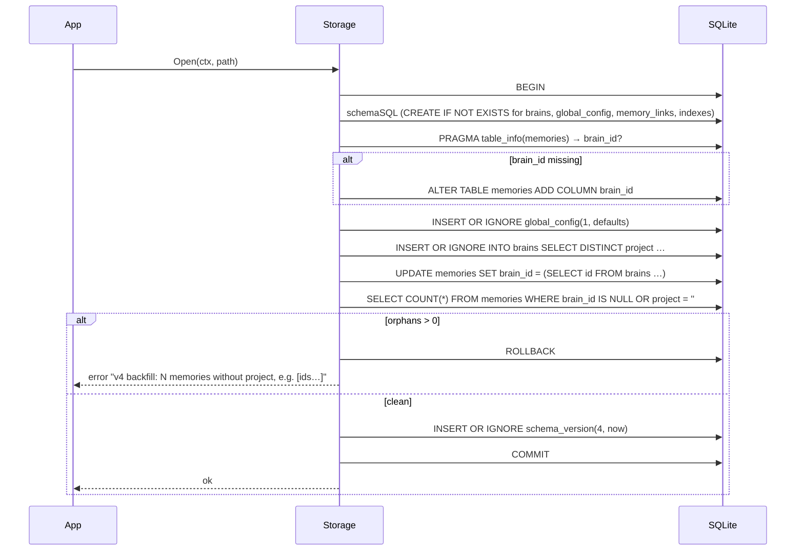
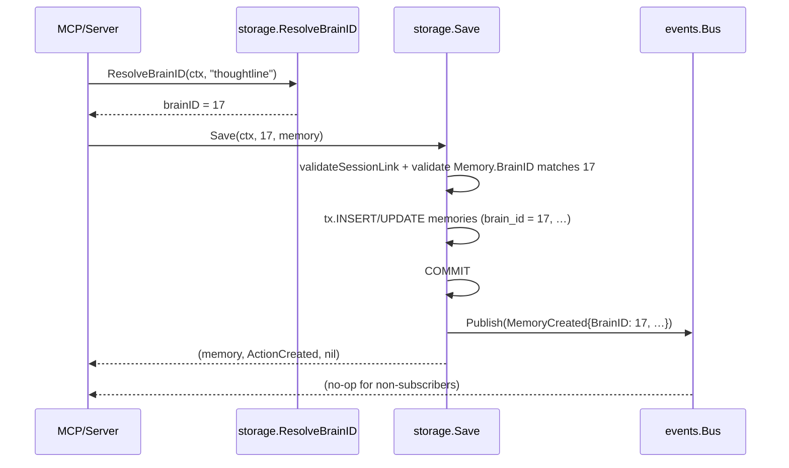
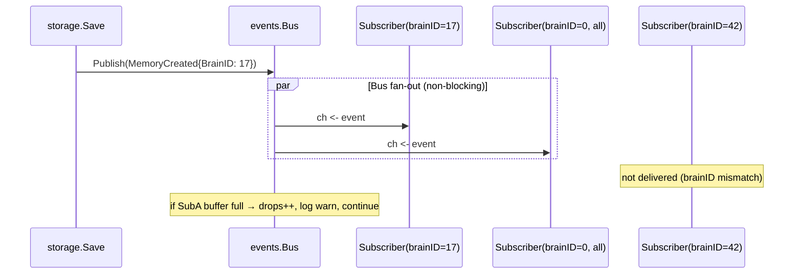

# Design: brain-foundation

> Phase 0 substrate for brAIn. Schema v3 → v4 (additive), four new packages, one
> isolation contract, zero MCP-visible behaviour change. The hard part is not
> what we add — it is making cross-brain leakage **impossible by construction**.

---

## 1. Schema v4 design

The DDL below is appended to `internal/storage/schema.go`'s `schemaSQL`
constant. All statements are `CREATE … IF NOT EXISTS` so a single concatenated
`Exec` is idempotent on every Open.

### 1.1 New table: `brains`

```sql
CREATE TABLE IF NOT EXISTS brains (
    id            INTEGER PRIMARY KEY AUTOINCREMENT,
    slug          TEXT    NOT NULL,                       -- stable identifier; mirrors memories.project today
    display_name  TEXT    NOT NULL,                       -- human label shown in brAIn
    kind          TEXT    NOT NULL CHECK (kind IN ('real','synthetic','sandbox')),
    description   TEXT    NOT NULL DEFAULT '',
    config_json   TEXT    NOT NULL DEFAULT '{}',          -- partial overlay onto global_config
    created_at    INTEGER NOT NULL,
    updated_at    INTEGER NOT NULL,
    archived_at   INTEGER                                  -- NULL = active
);

-- Slug uniqueness across ACTIVE brains only. Archived brains may keep their
-- old slug for archaeology; a new brain can reclaim it.
CREATE UNIQUE INDEX IF NOT EXISTS idx_brains_slug_active
    ON brains(slug)
    WHERE archived_at IS NULL;
```

**Why slug AND display_name** — `slug` is the machine identifier (matches
today's `memories.project` value 1:1, lowercase, kebab-case). `display_name`
is what brAIn renders. Splitting them now avoids a forced rename later when
users want pretty names.

**Why CHECK on kind** — closed enum at the DB level. SQLite rejects bad
inserts even if a future caller forgets to validate. Kind is a trust boundary
(`real` = the user's actual cognition; `synthetic`/`sandbox` = experiments) so
it must be unforgeable from above.

**Why `config_json` defaults to `'{}'`** — a brain with no override is the
common case. `'{}'` makes `Effective(global, override)` short-circuit cleanly
without NULL-handling sprawl.

### 1.2 New table: `global_config`

```sql
CREATE TABLE IF NOT EXISTS global_config (
    id          INTEGER PRIMARY KEY CHECK (id = 1),  -- singleton enforced by CHECK
    config_json TEXT    NOT NULL,
    updated_at  INTEGER NOT NULL
);
```

**Why `CHECK (id = 1)`** — singleton pattern. There can only ever be one row.
Any `INSERT` with id ≠ 1 is rejected by SQLite. The migration seeds `(1, '{…defaults…}')`
unconditionally with `INSERT OR IGNORE` so re-running migrate is a no-op.

### 1.3 New table: `memory_links`

```sql
CREATE TABLE IF NOT EXISTS memory_links (
    id         INTEGER PRIMARY KEY AUTOINCREMENT,
    brain_id   INTEGER NOT NULL REFERENCES brains(id)   ON DELETE CASCADE,
    from_id    INTEGER NOT NULL REFERENCES memories(id) ON DELETE CASCADE,
    to_id      INTEGER NOT NULL REFERENCES memories(id) ON DELETE CASCADE,
    relation   TEXT    NOT NULL CHECK (relation IN (
                  'supersedes','contradicts','refines','depends_on',
                  'references','related','derived_from')),
    weight     REAL    NOT NULL DEFAULT 1.0,
    source     TEXT    NOT NULL DEFAULT 'manual'
                       CHECK (source IN ('manual','auto','imported')),
    note       TEXT    NOT NULL DEFAULT '',
    created_at INTEGER NOT NULL,

    UNIQUE(from_id, to_id, relation)
);

CREATE INDEX IF NOT EXISTS idx_links_brain_from ON memory_links(brain_id, from_id);
CREATE INDEX IF NOT EXISTS idx_links_brain_to   ON memory_links(brain_id, to_id);
```

**Why `brain_id` is denormalised onto `memory_links`** — every link query
filters by brain. Without the column, neighbour queries would join through
`memories` twice. The denormalised column is enforced consistent by the
isolation guard in `internal/links` (insert validates that both endpoints'
`brain_id` matches the link's `brain_id` inside the same transaction).

**Why `UNIQUE(from_id, to_id, relation)`** — directional graph. `A supersedes B`
and `B supersedes A` are different rows; same triple twice is the same fact and
must fold. We don't enforce acyclicity in DDL — `supersedes` cycles are caller-level
data integrity, not schema.

**Why `ON DELETE CASCADE`** — deleting a brain or memory must take its links
with it, otherwise the graph shows ghosts. Cascade is correct here because
links are subordinate facts about endpoints.

**Why closed `relation` enum** — typed UI affordances in brAIn (different colour
per relation), prevents the inevitable taxonomy sprawl from open strings, and
makes the wire format stable. New relations are a deliberate schema change.

### 1.4 ALTER on `memories`

```sql
ALTER TABLE memories ADD COLUMN brain_id INTEGER REFERENCES brains(id);

CREATE INDEX IF NOT EXISTS idx_memories_brain
    ON memories(brain_id, updated_at DESC)
    WHERE deleted_at IS NULL;
```

Nullable in the DDL — populated unconditionally by backfill during the same
migration. Post-migration, the application invariant is *non-NULL* and the
isolation tests assert it. v5 will add `NOT NULL` in a separate change once
all writers go through the new path.

---

## 2. Migration sequence

The migration runs inside `(*Storage).migrate(ctx)` after the existing v2/v3
steps. It is wrapped in a single transaction so a partial failure cannot leave
the DB half-migrated. Pseudocode:

```go
func (s *Storage) migrateV4(ctx context.Context) error {
    tx, err := s.db.BeginTx(ctx, nil)
    if err != nil { return err }
    defer tx.Rollback()

    // 1. Run schemaSQL DDL (CREATE IF NOT EXISTS for new tables + indexes).
    //    schemaSQL is the entire DDL blob; new statements are appended in place.
    if _, err := tx.ExecContext(ctx, schemaSQL); err != nil {
        return fmt.Errorf("v4 ddl: %w", err)
    }

    // 2. Add memories.brain_id if absent. PRAGMA-driven, idempotent.
    has, err := columnExists(ctx, s.db, "memories", "brain_id")
    if err != nil { return err }
    if !has {
        if _, err := tx.ExecContext(ctx,
            `ALTER TABLE memories ADD COLUMN brain_id INTEGER REFERENCES brains(id)`); err != nil {
            return fmt.Errorf("add brain_id: %w", err)
        }
    }

    // 3. Seed global_config singleton with compiled defaults if missing.
    if _, err := tx.ExecContext(ctx,
        `INSERT OR IGNORE INTO global_config(id, config_json, updated_at) VALUES (1, ?, ?)`,
        config.DefaultGlobalJSON(), now); err != nil {
        return fmt.Errorf("seed global_config: %w", err)
    }

    // 4. Backfill brains: one row per DISTINCT memories.project, kind='real'.
    //    INSERT OR IGNORE so re-runs are no-ops.
    if _, err := tx.ExecContext(ctx, `
        INSERT OR IGNORE INTO brains (slug, display_name, kind, description,
                                      config_json, created_at, updated_at)
        SELECT project, project, 'real', 'Backfilled from v3 project',
               '{}', ?, ?
        FROM memories
        WHERE project IS NOT NULL AND project <> ''
        GROUP BY project`, now, now); err != nil {
        return fmt.Errorf("backfill brains: %w", err)
    }

    // 5. UPDATE memories.brain_id from brains.slug.
    if _, err := tx.ExecContext(ctx, `
        UPDATE memories
        SET brain_id = (SELECT id FROM brains WHERE brains.slug = memories.project)
        WHERE brain_id IS NULL`); err != nil {
        return fmt.Errorf("backfill brain_id: %w", err)
    }

    // 6. FAIL LOUDLY if any active memory still has NULL brain_id or empty project.
    var orphans int
    if err := tx.QueryRowContext(ctx, `
        SELECT COUNT(*) FROM memories
        WHERE deleted_at IS NULL
          AND (brain_id IS NULL OR project IS NULL OR project = '')`).Scan(&orphans); err != nil {
        return err
    }
    if orphans > 0 {
        // List the first 10 offending IDs so the operator can clean them.
        ids := collectOrphanIDs(ctx, tx, 10)
        return fmt.Errorf("v4 backfill: %d memories without project/brain_id, e.g. %v — fix manually then re-run", orphans, ids)
    }

    // 7. Indexes are already in schemaSQL (step 1).

    // 8. Bump schema_version.
    if _, err := tx.ExecContext(ctx,
        `INSERT OR IGNORE INTO schema_version(version, applied_at) VALUES (4, ?)`,
        now); err != nil {
        return err
    }
    return tx.Commit()
}
```

**Why one transaction** — SQLite supports DDL inside transactions. If step 6
fails, rollback restores the v3 state cleanly. The user re-runs after fixing
their data; we never leave a half-migrated DB on disk.

**Why backfill before the orphan check** — checking before the backfill would
trip on legitimate v3 data; checking after catches the *real* invariant
violation (memories with no project, which v3 already considered invalid).

---

## 3. Package layout

```
internal/
  brain/                — first-class brain entity
    brain.go            ─ CRUD: Create, GetBySlug, GetByID, ListActive, UpdateConfig, Archive
    types.go            ─ Brain struct, Kind enum + Valid(), slug regex
    brain_test.go
  config/               — two-level config resolution
    config.go           ─ Config struct, sub-structs (Ranking, Decay, Graph, Simulation), Version
    defaults.go         ─ compiled defaults; DefaultGlobalJSON() for migration seed
    resolve.go          ─ Effective(global Config, override json.RawMessage) → Config (deep merge)
    config_test.go      ─ table-driven: empty override, partial override, malformed JSON, unknown fields
  links/                — typed graph edges
    links.go            ─ Create, Delete, ListFrom, ListTo, Neighbors, Subgraph
    queries.go          ─ raw SQL constants kept readable
    links_test.go       ─ isolation suite + relation enum guard + ownership validation
  events/               — in-process pub/sub
    bus.go              ─ Bus, Subscribe, Publish, unsub closure
    events.go           ─ Event interface; concrete events: MemoryCreated, MemoryUpdated,
                          MemoryDeleted, LinkCreated, LinkDeleted, BrainConfigChanged
    bus_test.go         ─ -race, slow-subscriber drop policy, unsubscribe semantics
  storage/              — extended in place
    schema.go           ─ v4 DDL appended; currentSchemaVersion = 4
    storage.go          ─ migrateV4 wired into migrate(); every public method gains brainID
    brain_resolve.go    ─ slug → brain_id cache (compat shim for the project-string API)
    isolation_test.go   ─ NEW: two-brain fixture, every method asserted brain-tight
```

**Boundary rule** — `internal/storage` is the only package that talks SQL.
`brain`, `config`, `links`, `events` are *thin domain packages* layered on top:
they own validation, types, and orchestration; they delegate persistence to a
storage interface. This keeps the SQL surface auditable in one tree.

---

## 4. Storage API change (the load-bearing decision)

### Before (v3)

```go
func (s *Storage) Save(ctx, m memory.Memory) (memory.Memory, UpsertAction, error)
func (s *Storage) Search(ctx, q SearchQuery) ([]memory.Memory, error) // q.Project
func (s *Storage) GetByID(ctx, id int64) (memory.Memory, error)        // ⚠ no brain check
```

### After (v4)

```go
// Every per-brain method takes brainID as the FIRST required param.
// memory.Memory gains a BrainID field, populated on read; on write,
// storage validates BrainID matches brainID arg or returns ErrBrainMismatch.

func (s *Storage) Save(ctx, brainID int64, m memory.Memory) (memory.Memory, UpsertAction, error)
func (s *Storage) Search(ctx, brainID int64, q SearchQuery) ([]memory.Memory, error)
func (s *Storage) Recent(ctx, brainID int64, limit int) ([]memory.Memory, error)
func (s *Storage) GetByID(ctx, brainID int64, id int64) (memory.Memory, error) // returns ErrMemoryNotFound if id exists in another brain
func (s *Storage) UpdateByID(ctx, brainID int64, id int64, patch UpdatePatch) (memory.Memory, error)
func (s *Storage) SoftDelete(ctx, brainID int64, id int64) error
```

### Compat shim — keeping existing MCP tools working

The MCP server still speaks the `project` string today. We do NOT change the
MCP surface in this phase. The shim lives in `internal/storage/brain_resolve.go`:

```go
// resolveBrainID returns the brain_id for a project slug, creating no brains
// (creation is an explicit operator action). Caches per-Storage.
type brainCache struct {
    mu  sync.RWMutex
    m   map[string]int64
}

func (s *Storage) ResolveBrainID(ctx context.Context, slug string) (int64, error) {
    s.brains.mu.RLock()
    if id, ok := s.brains.m[slug]; ok {
        s.brains.mu.RUnlock()
        return id, nil
    }
    s.brains.mu.RUnlock()

    var id int64
    err := s.db.QueryRowContext(ctx,
        `SELECT id FROM brains WHERE slug = ? AND archived_at IS NULL`, slug).Scan(&id)
    if err != nil { return 0, err }

    s.brains.mu.Lock()
    s.brains.m[slug] = id
    s.brains.mu.Unlock()
    return id, nil
}

// Invalidation: brain.Create / brain.Archive call s.invalidateBrainCache(slug).
// Bus subscribers in brain pkg keep this honest if a future caller forgets.
```

**Why cache by slug** — the hot path is "MCP request arrives with project name,
need brain_id to query memories". Hitting SQLite for every request is
gratuitous when slug→id is monotonically stable except on create/archive.

**Why invalidate, not TTL** — staleness here is silent corruption (queries on
an archived brain). Event-driven invalidation is bounded and obvious; TTLs
hide bugs.

**Memory.BrainID field** — added to `memory.Memory`. Storage populates it on
every read; on write, if the caller leaves it zero we infer from `brainID arg`
(common case via shim); if the caller sets it to a different value than
`brainID arg`, we return `ErrBrainMismatch` — a programmer error.

---

## 5. Config resolution algorithm

```
Effective(global Config, overrideJSON json.RawMessage) → Config:
    if len(overrideJSON) == 0 || string(overrideJSON) == "{}":
        return global

    base  := marshalToMap(global)        // canonical map[string]any
    patch := unmarshalToMap(overrideJSON) // tolerant; unknown fields kept, warned

    deepMerge(base, patch)   // patch wins on scalars/arrays;
                             // nested objects merge recursively (NOT replaced);
                             // null in patch → delete key (revert to compiled default downstream)

    return unmarshalToConfig(base)  // tolerant: unknown fields warn, missing fields stay zero
```

### Tradeoff: lazy vs cached

**Cost of lazy** — every Save/Search that needs config does marshal-merge-unmarshal.
For a brain with no override, this is ~100ns (single map lookup). For a brain with
override, ~5–20µs.

**Cost of cached** — invalidation hazard: stale config silently changes ranking
behaviour. Cache must be busted on `BrainConfigChanged`, on global config update,
and on brain archive.

**Decision: lazy by default, optional per-Storage LRU keyed on (globalVersion,
brainID, configHash) with size 64.** Bus subscriber invalidates entries on
`BrainConfigChanged`. The LRU is opt-in via `Storage.WithEffectiveConfigCache(64)`
because for Phase 0 we don't yet read config in hot paths. We ship the API,
defer the cache wiring until profiling shows it matters.

---

## 6. Event bus design

```go
package events

type Event interface {
    BrainID()   int64
    Timestamp() time.Time
    Kind()      string  // "memory.created", "link.created", etc — for filtering
}

type Bus struct {
    mu      sync.RWMutex
    subs    map[int64][]subscription   // keyed by brainID; brainID=0 means "all brains"
    bufSize int                         // default 64
    drops   atomic.Uint64              // observable counter for tests + metrics
    log     *slog.Logger
}

type subscription struct {
    ch       chan Event
    closed   atomic.Bool
}

func New(log *slog.Logger) *Bus
func (b *Bus) Subscribe(brainID int64) (<-chan Event, func()) // second return is unsub
func (b *Bus) Publish(e Event)                                 // non-blocking
func (b *Bus) Drops() uint64                                   // for tests/metrics
```

### Buffer size: 64 per subscriber

Justification: A user's typing-storm in brAIn might fan out 10–20 events in a
second; the SQLite commit fan-in is bounded by single-writer WAL. 64 absorbs a
~3-second backlog before a slow subscriber starts losing events. 1024 wastes
memory on idle subscribers; 16 drops on legitimate bursts.

### Drop policy on overflow

```go
func (b *Bus) deliver(s *subscription, e Event) {
    select {
    case s.ch <- e:
        // delivered
    default:
        b.drops.Add(1)
        b.log.Warn("event bus drop", "kind", e.Kind(), "brain_id", e.BrainID())
    }
}
```

No block, no panic. Counter is observable so a smoke test can detect drop-rate
regression. A future change can promote drops to a metric or escalate slow
subscribers — not Phase 0.

### Unsubscribe semantics

The unsub closure:
1. Marks `subscription.closed = true` (atomic; future Publishes skip it).
2. Removes the subscription from `subs[brainID]`.
3. Closes `s.ch` so range loops terminate.

Calling unsub twice is a no-op (idempotent via the atomic flag).

### Test plan

- `bus_test.go` runs under `-race` (orchestrator forwards strict-tdd test command).
- **Slow subscriber fault injection**: subscribe and never read; publish 100 events;
  assert `Drops() >= 36` (100 - 64 buffer); assert other subscribers received all 100.
- **Unsub during publish race**: 1 publisher goroutine + 1 subscriber that unsubs
  mid-stream, assert no panic, no send-on-closed-channel.
- **Brain isolation**: subscribe to brain A; publish events for brain B; assert
  zero received.

---

## 7. Isolation invariant — the critical safety net

### Compile-time enforcement

Every public per-brain method takes `brainID int64` as its first non-context
param. There is **no signature** in the public API that accepts a memory or
link operation without a brainID. A caller who forgets gets a compile error,
not a runtime leak.

### Runtime enforcement (defence in depth)

Every SQL statement that reads or writes per-brain rows includes
`WHERE brain_id = ?` (or `AND brain_id = ?` joined with other predicates).
This is non-negotiable even when filtering by `id` or `sync_id` because IDs are
globally unique but a malicious or buggy caller could pass another brain's id.

```sql
-- ✅ Right
SELECT … FROM memories WHERE brain_id = ? AND id = ? AND deleted_at IS NULL;

-- ❌ Wrong (would leak across brains)
SELECT … FROM memories WHERE id = ? AND deleted_at IS NULL;
```

### Cross-brain link rejection

`links.Create(ctx, brainID, fromID, toID, relation, …)` runs inside a tx:

```go
// 1. Validate both endpoints belong to brainID.
var fromBrain, toBrain int64
tx.QueryRow(`SELECT brain_id FROM memories WHERE id = ? AND deleted_at IS NULL`, fromID).Scan(&fromBrain)
tx.QueryRow(`SELECT brain_id FROM memories WHERE id = ? AND deleted_at IS NULL`, toID).Scan(&toBrain)

if fromBrain != brainID || toBrain != brainID {
    return ErrCrossBrainLink  // sentinel error; testable
}

// 2. Insert with denormalised brain_id for query speed.
tx.Exec(`INSERT INTO memory_links(brain_id, from_id, to_id, relation, …) VALUES (?, ?, ?, ?, …)`,
        brainID, fromID, toID, relation, …)
```

### Escape hatch for admin/test only

```go
//go:build admin

func (s *Storage) UnsafeAcrossBrains() *AdminStorage { … }
```

Build-tagged. Production binaries ship without `-tags admin` so the symbol
literally does not exist. Used only by:
- Test fixtures that need to seed multiple brains.
- A future `tl admin` CLI for migration / debugging.

### Isolation test suite (`storage/isolation_test.go`)

```go
func TestBrainIsolation(t *testing.T) {
    s := newTestStorage(t)        // t.TempDir-backed SQLite
    a, b := setupTwoBrains(t, s)  // each gets 5 memories + 3 internal links

    cases := []struct {
        name string
        op   func(brainID int64) ([]int64, error)  // returns observed memory IDs
    }{
        {"Search",  func(id int64) ([]int64, error) { … }},
        {"Recent",  func(id int64) ([]int64, error) { … }},
        {"GetByID-foreign", func(id int64) ([]int64, error) {
            // try to GetByID(brainA.id, brainB.firstMemoryID) — must error
            … return nil, err
        }},
        {"ListLinks",     …},
        {"Neighbors",     …},
        {"Subgraph",      …},
        {"Update-foreign", …},
        {"Delete-foreign", …},
    }

    for _, tc := range cases {
        t.Run(tc.name+"/A", func(t *testing.T) {
            ids, _ := tc.op(a.id)
            for _, id := range ids {
                requireBelongsTo(t, s, id, a.id)
            }
        })
        // …mirror for B
    }
}

func TestBrainIsolation_Property(t *testing.T) {
    // Random 1000-step sequence of {Save, Update, Delete, Link, Unlink}
    // applied to both brains. After every step, assert per-brain counts
    // and aggregated checksums match an in-memory shadow model.
}
```

The isolation suite is the **regression spine** for this change. Any future
storage refactor must keep it green.

---

## 8. Sequence diagrams

### 8.1 v3 → v4 migration (with failure path)



### 8.2 Brain-aware Save (with config resolution)



### 8.3 Event flow on Save



### 8.4 Cross-brain link rejection

```mermaid
sequenceDiagram
    participant Caller
    participant Links as links.Create
    participant DB as SQLite

    Caller->>Links: Create(ctx, brainID=17, from=mA, to=mB, "supersedes")
    Links->>DB: BEGIN
    Links->>DB: SELECT brain_id FROM memories WHERE id = mA → 17
    Links->>DB: SELECT brain_id FROM memories WHERE id = mB → 42
    Links->>Links: 17 ≠ 42 ⇒ violation
    Links->>DB: ROLLBACK
    Links-->>Caller: ErrCrossBrainLink
```

---

## 9. Decisions log (ADR-style)

### ADR-1: Single `memory_links` table vs per-relation tables
- **Chosen**: single table with `relation` enum column.
- **Rationale**: one index strategy, one set of cascade rules, one migration story. The relation cardinality is small (7) but adding a new relation is a one-line CHECK constraint update, not a new table.
- **Rejected**: per-relation tables (`memory_supersedes`, `memory_contradicts`, …). More indexes, more cascades, schema sprawl. Only wins are micro-perf and per-relation columns we don't need.

### ADR-2: Closed `relation` enum vs open string
- **Chosen**: closed enum at DDL level (CHECK).
- **Rationale**: typed UI in brAIn, stable wire format, prevents taxonomy drift across users. Adding a relation is a deliberate, reviewable schema change.
- **Rejected**: open string with app-level validation. App-level validation is bypassable; the DB CHECK is not.

### ADR-3: In-process bus vs Redis/NATS
- **Chosen**: in-process channel-based pub/sub.
- **Rationale**: Thoughtline is a single-process service today. brAIn will consume Thoughtline as a library or via existing MCP transport. External brokers add ops surface for zero current benefit.
- **Rejected**: Redis pub/sub, NATS, custom WebSocket. Deferred to whenever Thoughtline becomes multi-process — then we wrap the in-process bus with a transport adapter, no code-level change to publishers.

### ADR-4: Required `brainID` parameter vs `context.Context` value
- **Chosen**: required positional parameter.
- **Rationale**: compile-time enforcement. A reviewer scanning a method signature sees `brainID` immediately. Forgetting it is a build failure.
- **Rejected**: `context.WithValue(ctx, brainKey, id)`. Runtime-only, easy to forget, easy to lie about, invisible at call sites. Context values are right for cross-cutting concerns (request ID, tracing) — wrong for a load-bearing isolation invariant.

### ADR-5: Lazy effective-config resolution vs eager cache
- **Chosen**: lazy by default; opt-in LRU with event-driven invalidation.
- **Rationale**: Phase 0 doesn't read config in hot paths. We ship the simple thing, profile, then add caching where it pays. Bus already broadcasts `BrainConfigChanged` so invalidation is plumbed if/when needed.
- **Rejected**: eager cache by default. Premature optimisation with a real correctness hazard (stale config = silently wrong ranking).

### ADR-6: Backfill failure on empty/missing project
- **Chosen**: refuse to migrate, surface offending IDs.
- **Rationale**: silently bucketing orphans into a `default` brain corrupts the trust boundary forever. A failed migration is recoverable; corrupted brain attribution is not.
- **Rejected**: silent default brain, NULL-tolerant brain_id. Both make the v5 cleanup harder and erode the isolation guarantee from day one.

### ADR-7: Slug uniqueness on active rows only
- **Chosen**: `UNIQUE INDEX … WHERE archived_at IS NULL`.
- **Rationale**: archived brains are historical artefacts, not live identifiers. A new "research" brain after archiving the old one is a normal lifecycle, not a name collision.
- **Rejected**: global slug uniqueness. Forces users to invent suffixes like `research-v2`. Bad UX, no benefit.

### ADR-8: Denormalised `brain_id` on `memory_links`
- **Chosen**: store `brain_id` on the link row, validate on insert.
- **Rationale**: every link query filters by brain. Without the column, every read joins through `memories`. Validation at insert keeps the column honest.
- **Rejected**: derive brain at query time. Doubles join cost on the hottest query (graph render).

---

## 10. Out of Scope (Phase 0)

Reaffirmed from the proposal — these come later:

- **WebSocket / external event transport.** Only in-process bus ships now.
- **New MCP tools** for brains, links, or config. Existing `tl_*` tools keep working via the project→brain_id shim.
- **Synthetic data generator.** The `kind = synthetic` enum value exists; the generator does not.
- **brAIn desktop UI.** Separate product, separate repo (Tauri + React + Cytoscape).
- **Importance / decay formula wiring.** Config sections (`Ranking`, `Decay`, `Graph`, `Simulation`) exist as struct shapes; the math that consumes them lands in a follow-up change.
- **Ranking behaviour change visible to MCP callers.** Phase 0 is invisible from outside.
- **Dropping `memories.project`.** That's v5 — only after every read path has migrated to `brain_id`.
- **Cross-brain queries / federation.** Deliberately impossible in Phase 0.
- **TUI dashboard changes.** Untouched in this phase.
